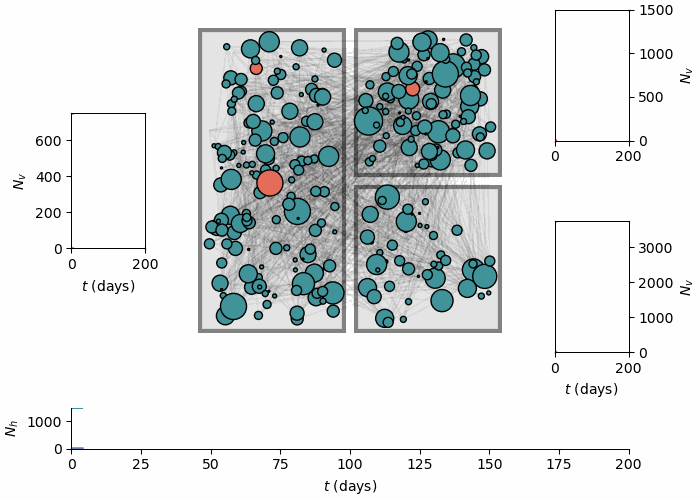
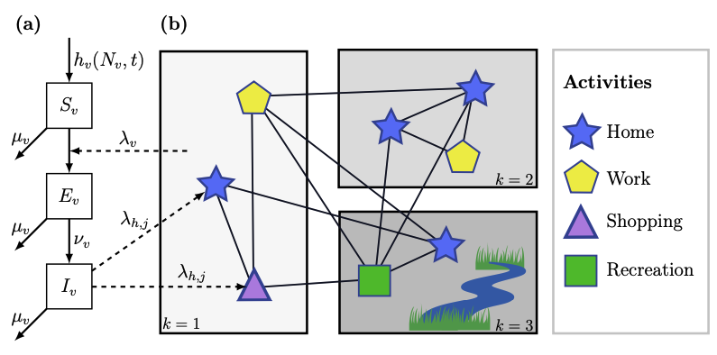

# MCS Project

All of my research work completed for my minor thesis in the Master of Computer Science (MCS) program at the University of Melbourne.

## Description of the project

Vector-borne diseases are major threats to global health infrastructure, representing approximately 17% of all infectious diseases[^1]. Despite the effectiveness of modern-day vector control methods such as insecticides, these methods rely primarily on self-participation and voluntary adoption, which are influenced by individuals' perceived risk of infection and personal behavioural attitudes. To inform policy and response to VBD outbreaks, mathematical models of VBD spread are becoming increasingly popular among health practitioners. However, these models assume homogeneity of populations, and inherently cannot incorporate heterogeneous behavioural decision-making processes that influence vector control efficacy.

Agent-based modelling is a computational technique to generate complex phenomena from the ground up by simulating individual components (agents) of a system, potentially offering a solution to encoding human behaviour for VBD spread. Although these models have seen success in VBD contexts, there is still a lack of research investigating the interaction between human behaviour and vector control campaigns. Furthermore, there have been no comparative studies to analyse the impacts of different behavioural decision-making processes on disease spread within these models.

This project will consist of two phases. First, an existing agent-based model[^2] will be extended to analyse the impacts of using different behavioural frameworks from psychology as agent decision-making processes, in order to simulate the adoption of preventive measures within a community. Second, a targeted community-based intervention for vector control will be simulated, in order to evaluate effective strategies to target VBD spread in the context of risk perception and preventive behaviours.

### The model



The model in this project simulates a community (multiple villages/households) with agents (residents) that move about the map (a network). Each node in the above visualisation is a location agents can travel to, and each node has an associated activity the agent is assumed to engage in, with varying levels of vector exposure.

Each location (node) has an associated _patch_ (in the above visualisation, there are three). These patches can be parameterised to encode heterogeneous geographical and environmental properties, altering the dynamics of vector populations within each patch (and consequentially, nodes of each patch). Each patch is governed by its own system of ordinary differential equations that encode the SEI (Susceptible-Exposed-Infected) model for vectors in a patch.

These patch models are coupled with the agent-based network model. The figure below, adapted from Manore et al. (2015), conveys this coupling:



At each time step, information from the vector model is used to derive the force of infection on agents in corresponding nodes and patches. Reciprocally, the number of infectious agents in a patch (across all nodes) is used to derive the force of infection on vectors. Ultimately, these interactions give rise to the SEIR dynamics demonstrated in the visualisation.


## Purpose and structure of this repository

This repository stores my work spanning the ~36 week-period of the MCS minor thesis project. Below, I describe the structure of the repository:

```
.
├── analysis
├── models
│   ├── baseline
│   └── scripts
├── presentation
├── proposal
│   └── sections
└── thesis
```

- `analysis` contains Jupyter notebooks that perform data analysis according to different stages of the project.
- `models` stores all code written and developed for the project.
    - `baseline` contains the reproduced model from Manore _et al._ (2015)[^2].
    - `scripts` contains various scripts written to test models.
- `presentation` contains my work for the oral presentation (worth 5%).
- `proposal` contains my work for the research proposal component (worth 30%).
- `thesis` contains my work for the final report (worth 65%).

## Usage

To build the baseline model and replicate the results, navigate to `models` directory and install the prerequisites:

```
pip install -r requirements.txt
```

then run the desired Jupyter notebook.

## Roadmap

- [X] Reproduce baseline model from Manore _et al._ (2015)[^2]
    - [X] Build first model version
    - [X] Build script to reproduce figures from original paper
    - [X] Tidy up codebase
- [ ] Build visualisation
    - [X] Build baseline visualisation
    - [ ] Extend visualisation with additional model features
- [X] Add `requirements.txt` to repository
- [ ] Add test scripts
    - [ ] Demonstrate model replication
- [ ] Extend model to include preventive measures
    - [ ] Introduce preventive measures with baseline rate of adoption
- [ ] Computationally encode behavioural frameworks
    - [ ] Proof of concept with the Health Belief Model
    - [ ] Implement others
    - [ ] Conduct data analysis
- [ ] Represent one or more community-based interventions in the ABM
    - [ ] Conduct data analysis


## Acknowledgements

I am incredibly fortunate to be supervised by Associate Professor Nic Geard and Dr Cameron Zachreson from the School of Computing and Information Systems at the University of Melbourne.

The hybrid agent-based model used for this research project will be an extension of the work from Manore _et al._, “A Network-Patch Methodology for Adapting Agent-Based Models for Directly Transmitted Disease to Mosquito-Borne Disease.”[^2]

[^1]: https://www.who.int/news-room/fact-sheets/detail/vector-borne-diseases
[^2]: https://doi.org/10.1080/17513758.2015.1005698

